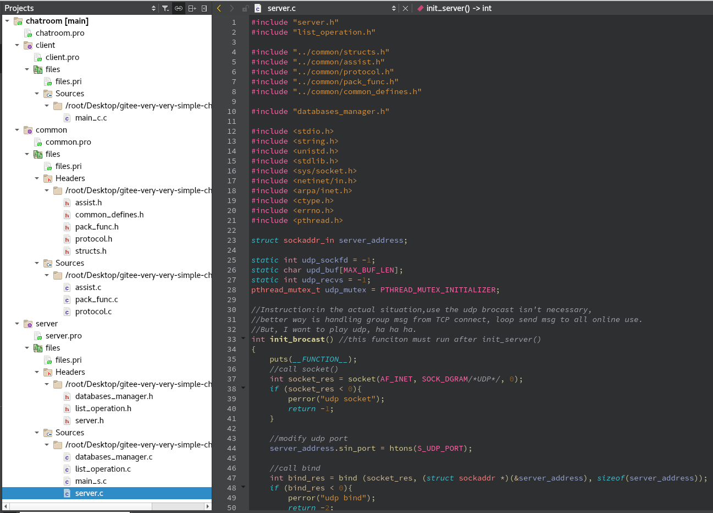

How to run?

server:

    cd ./src/server

    ./1

client:

    cd ./src/client

    ./1

# very-very-simple-chatroom
It's very very simple exerciser.
Use Qt creator coding。

date:2022-3-5
debuging：

===============================Finish V1.0===============================

date:2022-8-21
断断续续地写完这个代码，前后加起来总时间估计有20天。（woshifeiwu）
Qtcreator写代码还是挺方便的，主要用得习惯，当然VSCode也是非常好的写代码工具。

简而言之， **very-very-simple-chatroom** 有以下内容：

代码结构：

介绍：
是局域网linux终端的简易聊天室,“数据库”的使用为了简便只使用txt文件。理论上支持1000人聊天，实际我只测了十几人同时在线聊天没问题，多的还没测试。

功能：
- 注册
- 登录（同ID挤掉上个号继续登录）
- 群聊（UDP）
- 私聊（TCP）

此项目主要使用的技术有：
- select服务器模型
- Posix多线程
- 互斥锁
- recv send recvfrom sendto，PEEK非堵塞
- 自定义协议校验头尾
- TCP UDP socket
- txt文件操作
- 信号处理
- C基础操作：链表、数组、函数指针、字符串处理、fgets、fcntl

TODO：
1. 妈的这个程序的逻辑处理毫无算法可言，基本上都是for while暴力法来处理。
2. 应该增加心跳包机制来判断客服端是否掉线
3. 增加日志模块
